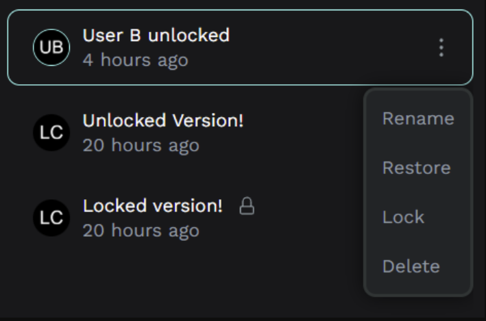

<table style="width: 100%; border: none; text-align: left;">
  <tr>
    <td style="width: 30%; vertical-align: top; text-align: center;">
      <a href="http://lauriecrean.dev">
        
      </a>
    </td>
    <td style="width: 70%; vertical-align: top;">
      <h1><a href="http://lauriecrean.dev">LaurieCrean.dev</a></h1>
      <p>Recent Activity Feed</p>
    </td>
  </tr>
</table>

# Open Source Contributions
Now running in production across millions of business applications.

##  Rolls-Royce, terraform-provider-cscdm, Go

1. **[HTTP timeout to prevent Terraform hanging](https://github.com/rropen/terraform-provider-cscdm/pull/16)**<br>*Added 30-second HTTP request timeout to prevent the Terraform provider from hanging indefinitely when the CSC Domain Manager API accepts connections but doesn't respond.*
   <details><summary><code>+11/-8</code></summary>

   ```diff
   // internal/cscdm/cscdm.go
   const (
       CSC_DOMAIN_MANAGER_API_URL = "https://apis.cscglobal.com/dbs/api/v2/"
       POLL_INTERVAL              = 5 * time.Second
       FLUSH_IDLE_DURATION        = 5 * time.Second
   +   HTTP_REQUEST_TIMEOUT       = 30 * time.Second
   )

   func (c *Client) Configure(apiKey string, apiToken string) {
   -   c.http = &http.Client{Transport: &util.HttpTransport{
   +   c.http = &http.Client{
   +       Timeout: HTTP_REQUEST_TIMEOUT,
   +       Transport: &util.HttpTransport{
               BaseUrl: CSC_DOMAIN_MANAGER_API_URL,
               Headers: map[string]string{
                   "accept":        "application/json",
                   "apikey":        apiKey,
                   "Authorization": fmt.Sprintf("Bearer %s", apiToken),
               },
   -       }}
   +       }}
   ```
   </details>

2. **[Flush loop and trigger handling improvement](https://github.com/rropen/terraform-provider-cscdm/pull/9)**<br>*Replaced `sync.Cond` with buffered channels to fix goroutine leaks, added `sync.Once` to prevent panics, and enabled recovery from transient failures instead of permanent termination.*
   <details><summary><code>+483/-19</code></summary>

   ```diff
   // internal/cscdm/cscdm.go
   type Client struct {
   -   flushTrigger      *sync.Cond
   +   flushTrigger      chan struct{}
       flushLoopStopChan chan struct{}
   +   stopOnce          sync.Once
   }

   func (c *Client) Configure(apiKey string, apiToken string) {
   -   c.flushTrigger = sync.NewCond(&sync.Mutex{})
   +   c.flushTrigger = make(chan struct{}, 1)
   }

   func (c *Client) flushLoop() {
       for {
   -       triggerChan := make(chan struct{})
   -       go func() {
   -           c.flushTrigger.L.Lock()
   -           c.flushTrigger.Wait()
   -           c.flushTrigger.L.Unlock()
   -           close(triggerChan)
   -       }()

           select {
   -       case <-triggerChan:
   +       case <-c.flushTrigger:
               flushTimer.Stop()
           case <-flushTimer.C:
               err := c.flush()
               if err != nil {
   -               return  // Error kills loop permanently
   +               // Continue - don't terminate on transient errors
               }
           }
       }
   }

   func (c *Client) Stop() {
   -   close(c.flushLoopStopChan)
   +   c.stopOnce.Do(func() {
   +       close(c.flushLoopStopChan)
   +   })
   }
   ```
   </details>

##  GoCardless, woocommerce-gateway, PHP

- **[Inconsistent subscriptions fix after cancellation](https://github.com/gocardless/woocommerce-gateway-gocardless/pull/88)**<br>*Fixed subscription status incorrectly showing "Pending Cancellation" instead of "Cancelled" when users cancel before GoCardless payment confirmation. Added centralized cancellation handling with parent order status synchronization.*
   <details><summary><code>+81/-0</code></summary>

   ```diff
   + public function handle_subscription_cancellation($subscription_id) {
   +     // Centralized cancellation with parent order sync
   + }

   + public function maybe_skip_pending_cancel_status($skip, $subscription) {
   +     $payment_status = get_post_meta($parent_id, '_gocardless_payment_status');
   +     if (!in_array($payment_status, ['confirmed', 'paid_out'])) {
   +         return true;  // Skip pending-cancel, cancel immediately
   +     }
   + }
   ```
   </details>

##  Google, Guava, Java

1. **[Resource leak fix in FileBackedOutputStream](https://github.com/google/guava/pull/7986)**<br>*Fixed file handle exhaustion by adding proper exception handling to ensure FileOutputStream is closed when IOException occurs during memory-to-file transition.*
   <details><summary><code>+96/-1</code></summary>

   ```diff
   + FileOutputStream fos = null;
   + try {
       fos = new FileOutputStream(file);
       fos.write(data);
   + } catch (IOException e) {
   +     if (fos != null) fos.close();  // prevent handle leak
   +     throw e;
   + }
   ```
   </details>

2. **[Error messages improvement for synthetic TypeVariables](https://github.com/google/guava/pull/7974)**<br>*Replaced unhelpful `UnsupportedOperationException("methodName")` with descriptive error messages explaining why annotations aren't supported on synthetic TypeVariables created by TypeResolver.*
   <details><summary><code>+19/-5</code></summary>

   ```diff
   - throw new UnsupportedOperationException("isAnnotationPresent");
   + throw new UnsupportedOperationException(
   +     "Annotation methods are not supported on synthetic TypeVariables "
   +     + "created during type resolution. See b/147144588.");
   ```
   </details>

3. **[mergeSorted() stability fix](https://github.com/google/guava/pull/7989)**<br>*Fixed unstable ordering of equal elements by tracking iterator insertion order and using it as a tiebreaker, ensuring elements from earlier iterators appear before equal elements from later ones.*
   <details><summary><code>+167/-10</code></summary>

   ```diff
   + class IndexedIterator<T> {
   +     final int index;  // track insertion order
   +     final PeekingIterator<T> iterator;
   + }

   - Queue<PeekingIterator<T>> queue;
   + Queue<IndexedIterator<T>> queue;  // use index as tiebreaker
   ```
   </details>

4. **[mergeSorted() instability test coverage](https://github.com/google/guava/pull/7988)**<br>*Added test cases demonstrating the instability problem in `Iterators.mergeSorted()` as requested by maintainers, verifying the bug exists before the fix PR.*
   <details><summary><code>+134/-0</code></summary>

   ```diff
   + // Test requested by @kevinb9n to demonstrate bug exists
   + public void testMergeSorted_demonstratesInstability() {
   +     // [B1, C1] + [A2, C2] → should be [A2, B1, C1, C2]
   +     // but unstable impl may return [A2, B1, C2, C1]
   + }
   ```
   </details>

5. **[putIfAbsent test for null values](https://github.com/google/guava/pull/7987)**<br>*Added test to verify `putIfAbsent` correctly replaces existing null values, catching non-compliant Map implementations that pass the test suite despite violating the JavaDoc specification.*
   <details><summary><code>+14/-0</code></summary>

   ```diff
   + public void testPutIfAbsent_replacesNullValue() {
   +     map.put(key, null);
   +     assertNull(map.putIfAbsent(key, newValue));
   +     assertEquals(newValue, map.get(key));
   + }
   ```
   </details>

##  Stripe, pg-schema-diff, Go

- **[GENERATED ALWAYS AS columns support](https://github.com/stripe/pg-schema-diff/pull/232)**<br>*Fixed migration failures where generated columns were incorrectly treated as DEFAULT columns. Updated schema introspection to detect `pg_attribute.attgenerated`, extended the Column model, and fixed DDL generation to output proper `GENERATED ALWAYS AS ... STORED` syntax.*
   <details><summary><code>+275/-37</code></summary>

   ```diff
   // Schema introspection
   + (a.attgenerated = 's') AS is_generated,
   + CASE WHEN a.attgenerated = 's'
   +     THEN pg_get_expr(d.adbin, d.adrelid)
   + END AS generation_expression,

   // DDL generation
   - sb.WriteString(fmt.Sprintf(" DEFAULT %s", column.Default))
   + if column.IsGenerated {
   +     sb.WriteString(fmt.Sprintf(" GENERATED ALWAYS AS (%s) STORED",
   +         column.GenerationExpression))
   + }
   ```
   </details>

##  Microsoft, TypeAgent, TypeScript

- **[Return undefined for partial matches](https://github.com/microsoft/TypeAgent/pull/1478)**<br>*Prevented exceptions when typing partial cached commands by returning `undefined` instead of invalid "unknown.unknown" action names, enabling graceful handling of partial matches.*
   <details><summary><code>+10/-10</code></summary>

   ```diff
   // ts/packages/cache/src/constructions/constructionValue.ts
       if (actionProps === undefined) {
           if (partial) {
   -           return { fullActionName: "unknown.unknown" };
   +           return { fullActionName: undefined };
           }
           throw new Error("Internal error: No values provided");
       }

       if (actionProps.fullActionName === undefined) {
   -       if (partial) {
   -           actionProps.fullActionName = "unknown.unknown";
   -       } else {
   +       if (!partial) {
               throw new Error("Internal error: fullActionName missing");
           }
   +       // Leave undefined for partial matches
       }

   // ts/packages/cache/src/explanation/requestAction.ts
   function fromJsonAction(actionJSON: JSONAction) {
   -   const { schemaName, actionName } = parseFullActionNameParts(
   -       actionJSON.fullActionName,
   -   );
   +   const { schemaName, actionName } =
   +       actionJSON.fullActionName !== undefined
   +           ? parseFullActionNameParts(actionJSON.fullActionName)
   +           : { schemaName: undefined, actionName: undefined };
   ```
   </details>

##  Penpot, Clojure and SQL



- **[Milestone lock feature to prevent deletion](https://github.com/penpot/penpot/pull/6982)**<br>*Implemented version locking system allowing users to protect saved milestones from accidental deletion or bad actors. Added database migration, RPC endpoints with authorization, and UI with visual lock indicators.*
   <details><summary><code>+292/-17</code></summary>

   ```diff
   -- SQL migration
   + ALTER TABLE file_change ADD COLUMN locked_by UUID;

   ;; Clojure RPC
   + (defn lock-snapshot [snapshot-id user-id]
   +   (when (not= (:created-by snapshot) user-id)
   +     (throw (ex-info "unauthorized"))))
   ```
   </details>

# Developer Projects
My favourite Personal Projects 👇🏼
